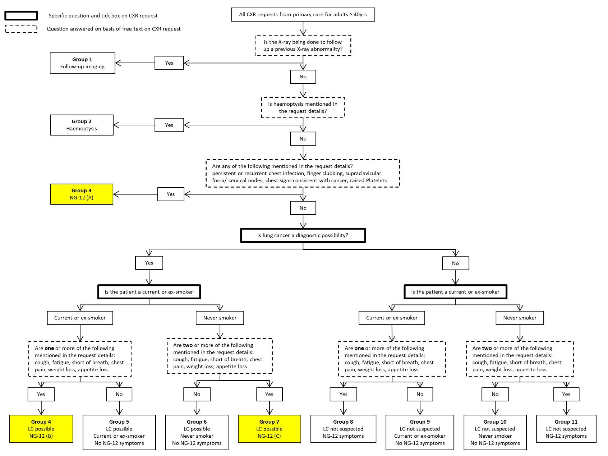

# NG12 CXR SQL Classification Algorithm

This repository provides a structured SQL Server–based algorithm to identify whether chest X-ray (CXR) requests from primary care meet the National Institute for Health and Care Excellence (NICE) NG12 criteria for suspected lung cancer.

## Overview

The algorithm analyses:
- Free-text referral information (`ClinicalDetails`)
- Structured fields: smoking status and whether the referrer suspects cancer

It applies rule-based logic to classify requests against NG12 criteria and compares results to expert-assigned reference labels for validation.

## Flow Diagram

The NG12 classification logic follows this structured pathway:

## Repository Contents

- `create_table.sql`: Creates the `CXRTable` with all required fields and documentation
- `populate_derived_fields.sql`: Cleans clinical text, extracts symptoms, applies NG12 classification logic, and compares against expert reference

## NG12 Logic

NG12 compliance is defined using three key logic groups:

- **NG12A**: One or more of the "5 criteria" (e.g. recurrent chest infections, clubbing)
- **NG12B**: One or more of the "6 symptoms" in a current/ex-smoker AND cancer is suspected
- **NG12C**: Two or more of the "6 symptoms" in a never-smoker AND cancer is suspected

## Table Structure

The `CXRTable` includes both input and derived fields:

| Column                | Description |
|-----------------------|-------------|
| `ClinicalDetails`     | Free-text CXR request information |
| `SmokingStatus`       | Structured field ('Current smoker', 'Ex-smoker', 'Never smoked') |
| `LungCancerPossibility` | Structured field ('Yes', 'No') |
| `Category`            | Expert-assigned classification (see comments in `create_table.sql`) |
| `Cough`, `Fatigue`, `ShortnessOfBreath`, etc. | Derived symptom flags (1/0) |
| `NG12A`, `NG12B`, `NG12C` | Flags indicating NG12 criteria groups met |
| `TestPositive`        | Algorithm's NG12 classification result |
| `GroundTruthPositive` | Derived from expert-assigned category |
| `Matrix`              | Comparison result (TP, FP, FN, TN) for evaluation |

## How to Use

1. **Create the table**: Run `create_table.sql` in your SQL Server database
2. **Insert or import data**: Free text and structured fields must be included
3. **Run the algorithm**: Execute `populate_derived_fields.sql` to apply cleaning and logic
4. **Review performance**: Use the `Matrix` field to compare results to ground truth and calculate metrics (e.g. accuracy, sensitivity)

## Example Metrics

For 241 test cases, the algorithm achieved:
- **Accuracy**: 98.3%
- **Sensitivity**: 96.2%
- **Specificity**: 99.4%
- **Positive Predictive Value (PPV)**: 98.7%
- **Negative Predictive Value (NPV)**: 98.2%

## License

This project is licensed under the MIT License. See the [LICENSE](LICENSE) file for details.

## Citation

If you use this code or adapt it for research or service evaluation, please cite:

> Bramley R. NG12 CXR SQL Classification Algorithm. GitHub. https://github.com/rhidianbramley/ng12-cxr-sql

## Disclaimer

This tool is intended for research, audit, or proof-of-concept use only. It should not be used for clinical decision-making without local validation and safety assurance.

